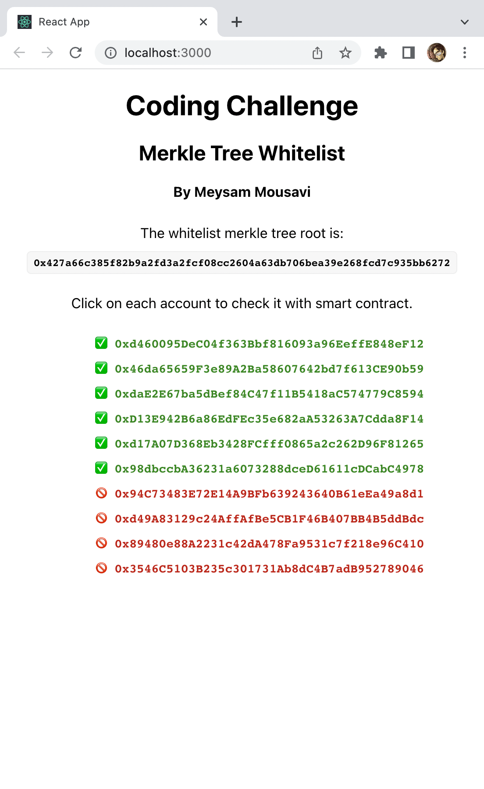
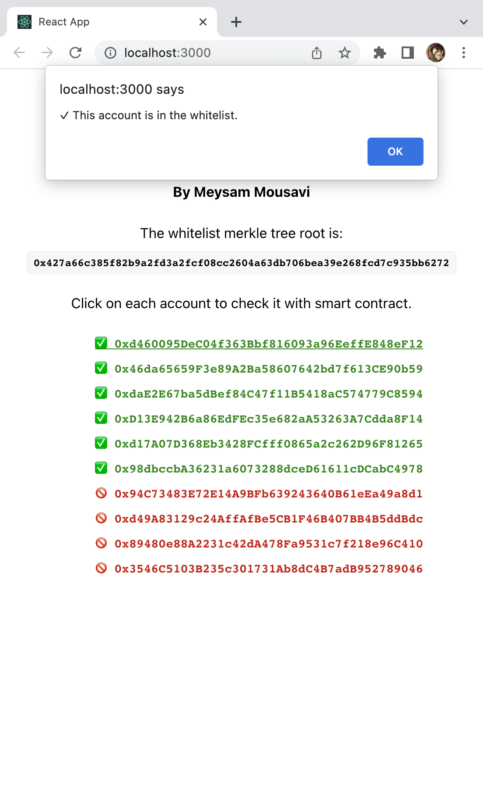
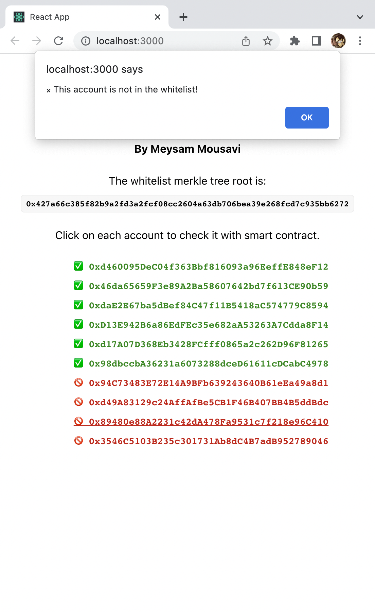

# Merkle Tree Whitelists

This is an implementation of NFT whitelists using merkle trees from scratch. It consists of a validation smart contract and a simple dApp to test some accounts.

To run the sample first install truffle with `npm i -g truffle`. Then start truffle dev server with `truffle develop`. Then you can run the dApp with `cd client && npm run start`.

<table>
    <tr>
        <td></img></td>
        <td></img></td>
        <td></img></td>
    </tr>
</table>